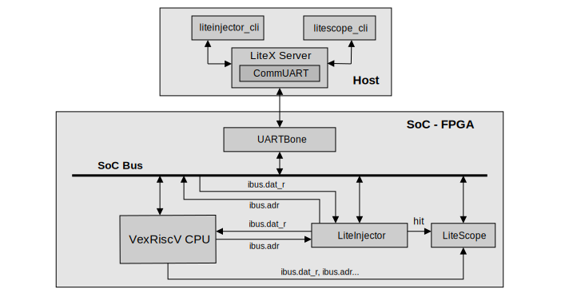

================================
Using LiteInjector and LiteScope
================================

Why use both ?
--------------

LiteScope is an interesting tool, and there are many advantages to using LiteScope at the same time as LiteInjector. When you carry out fault injection, it is useful to be able to see the emulator's input and output signals. This allows you to check that the fault injection has been carried out correctly. You can also use LiteScope to carry out an in-depth analysis of your SoC and prepare your injection campaigns. Finally, if you want to contribute to the LiteInjector project by adding new features or improving existing ones, you can debug the emulator using LiteScope. LiteInjector provides access to its internal signals and can therefore be analysed using LiteScope.

   Example SoC that use LiteInjector and LiteScope.

Sample code
-----------

The example code provided is a simple counter modified to inject faults. LiteInjector and LiteScope are controlled here by a UART bridge, declared under the name "liteinjector". The logic analyser takes several signals as input. There are all the counter singnals and the emulator's trigger signal, which makes it possible to place an event on this signal and capture the moment when the fault is injected. 

The code presented here is for testing the operation of the injector, you will find the test steps in the next section.

To learn how to use the LiteScope tool, please read the LiteX `documentation <https://github.com/enjoy-digital/litex/wiki/Use-LiteScope-To-Debug-A-SoC>`_, which is very self-explanatory and makes it easy to get to grips with the tool.

.. code-block:: python

    # Counter PoC ------------------------------------------------------------------------------
    count_test_signal = Signal(16)
    count_reset = Signal(26)
    injector_output = Signal(16)

    self.sync += count_reset.eq(count_reset + 1)
    self.sync += [
        If(count_reset == 0b11111111111111111111111111,
            count_test_signal.eq(injector_output + 1)
        )
    ]

    self.submodules.sseg = SSEG(platform, count_test_signal)

    # LiteInjector -----------------------------------------------------------------------------
    injector_signals = [count_test_signal, count_reset]

    self.submodules.injector = LiteInjector(injector_signals,
        depth        = 16,
        csr_csv = "injector.csv")
    self.add_csr("injector")

    self.comb += injector_output.eq(self.injector.o_count_test_signal)

    # LiteScopeAnalyzer ------------------------------------------------------------------------
    analyzer_signals = [
        count_test_signal,
        count_reset,
        injector_output,
        self.injector.trigger.output_hit
    ]

    self.submodules.analyzer = LiteScopeAnalyzer(analyzer_signals,
        depth        = 512,
        csr_csv      = "analyzer.csv")
    self.add_csr("analyzer")

    self.add_uartbone("liteinjector")

For example, if you want to use LiteScope to retrieve the time at which the fault injection was carried out, you can use the following commands :

.. code-block:: console

    // Launch LiteX Server in a new terminal
    $ litex_server --uart --uart-port /dev/ttyXXX
    // Then use LiteScope CLI
    $ litescope_cli -r main_injector_trigger_output_hit