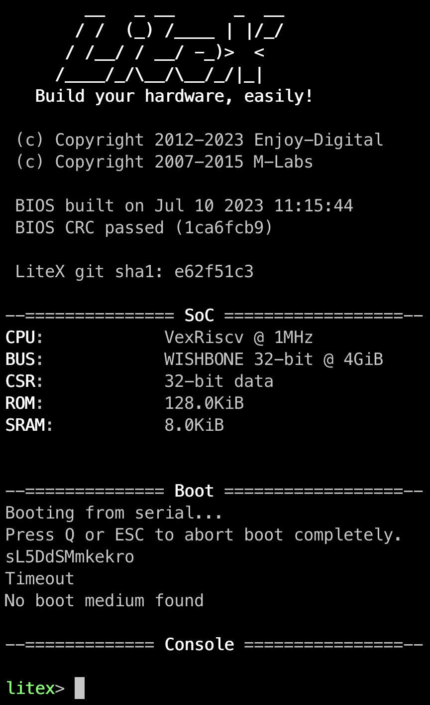

=================================
Installing LiteX and LiteInjector
=================================

Before starting
---------------

.. note::
    Before starting to install LiteX, I advise you to create a Python virtual environment, which will allow you to have several instances of LiteX. In addition, virtual environments avoid all version and dependency problems.

    To create a virtual environment you can use the command :
    
    .. code-block:: console
        
        $ python -m venv <virtual_env_name>

    And to use the virtual environment, use the following command :

    .. code-block:: console
        
        $ source <virtual_env_name>/bin/activate

Installing LiteX
----------------

Installing LiteX is relatively simple. Using the commands below you can install the latest version of LiteX with the standard modules. If you wish to change the installation configuration, you can change the :code:`--config=(minimal, standard, full)` parameter. The :code:`full` config installation add more CPU module available for your SoCs.

.. code-block:: console
    
    $ wget https://raw.githubusercontent.com/enjoy-digital/litex/master/litex_setup.py
    $ chmod +x litex_setup.py
    $ ./litex_setup.py --init --install --config=standard --tag=2022.08

The commands below allow you to install the LiteInjector emulator. To run the emulator and LiteX, you need to install the dependencies in the :code:`requirements.txt` file. Once the dependencies have been installed, you can install the LiteInjector package. Finally, we install the RiscV toolchain, which allows us to compile the software part of the SoC.

.. code-block:: console

    $ git clone https://github.com/labsticc-arcad/LiteInjector.git liteinjector
    $ pip install -r liteinjector/requirements.txt
    $ pip install -e liteinjector
    $ ./litex_setup.py --gcc=riscv

Now that LiteX and LiteInjector are fully installed. You can test that the installation is working correctly by running a simulation. The following commands install what you need to run simulations and then run a simulation of a LiteX SoC with a VexRiscV processor.

.. code-block:: console

    $ sudo apt install libevent-dev libjson-c-dev verilator
    $ litex_sim --cpu-type=vexriscv

   LiteX SoC simulation output.