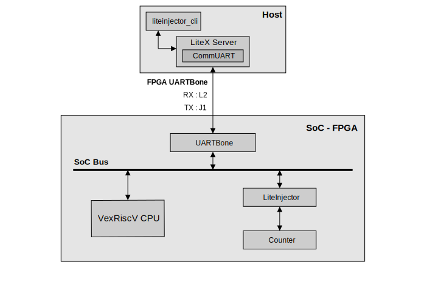

=================
Test the emulator
=================

Introduction
------------

In this section we present a test code and commands for testing the emulator. The code provided is the same as that used to demonstrate LiteScope integration when using the emulator. The aim of this test is to inject a fault into a counter.

We are using a Digilent Basys3 FPGA board, designed to run at 75MHz. The counter uses a clock divider to increment the counter every second.

.. code-block:: python

    # Counter PoC ------------------------------------------------------------------------------
    count_test_signal = Signal(16)
    count_reset = Signal(26)
    injector_output = Signal(16)

    self.sync += count_reset.eq(count_reset + 1)
    self.sync += [
        If(count_reset == 0b11111111111111111111111111,
            count_test_signal.eq(injector_output + 1)
        )
    ]

    self.submodules.sseg = SSEG(platform, count_test_signal)

    # LiteInjector -----------------------------------------------------------------------------
    injector_signals = [count_test_signal, count_reset]

    self.submodules.injector = LiteInjector(injector_signals,
        depth        = 16,
        csr_csv = "injector.csv")
    self.add_csr("injector")

    self.comb += injector_output.eq(self.injector.o_count_test_signal)

    self.add_uartbone("liteinjector")

Try it yourself
---------------

First, you need to go to the folder containing the example code for testing the emulator. Then we'll build the SoC associated with the example code, which will also generate the configuration files needed to use the emulator's control tools.

.. code-block:: console

    $ cd liteinjector/examples/emulator_example
    $ ./digilent_basys3.py --csr-csv=csr.csv --build --load

Normally you should have 3 files created: :code:`csr.csv`, :code:`injector.csv` and :code:`analyzer.csv`. These 3 configuration files are necessary to use the emulator. Before running the emulator controller, you need to connect a new UART to the FPGA board.

Here is a representation of our test SoC and the pins used by the UARTBone.

   Representation of our test SoC.

Now that the SoC is loaded onto the FPGA and the new UART is connected to the FPGA board, we can use the software controller. First of all, we need to launch LiteX Server and specify the port used by the UART bridge. Then we can use the :code:`liteinjector_cli` utility to control the emulator.

In a new terminal, open LiteX Server, without closing the terminal.

.. code-block:: console

    $ litex_server --uart --uart-port /dev/ttyXXX

Now you can use the :code:`liteinjector_cli` utility to inject a fault into the counter signal. To find out all the parameters of the utility you can use the command :code:`liteinjector_cli -h`.

.. code-block:: console

    $ liteinjector_cli -v main_count_clk_divider 0x3FFFFFF 0 -bv main_count_result 0xFFFF 0

This command changes the counter value to :code:`0`. The :code:`-v` parameter is used to add a trigger by specifying the name of the signal, here :code:`main_count_clk_divider`, then the value of the signal, here :code:`0x3FFFFFF` and finally the trigger ID. Next, the :code:`-bv` parameter is used to replace the value of a signal, by first specifying the signal to be attacked, here :code:`main_count_result`, then the value of the signal, here :code:`0xFFFF` and finally the trigger ID. In this example, we choose to detect the moment when the clock divider updates the counter value and we inject a fault so that the signal takes the value :code:`0xFFFF`. In the counter logic, this value is incremented before being connected to the counter register, which will set the register value to :code:`0`.

Use LiteScope
-------------

If you want to try using LiteScope alongside the emulator, you can open a new terminal and use the following commands :

.. code-block:: console

    $ cd liteinjector/examples/emulator_example
    $ litescope_cli -r main_injector_trigger_output_hit

Now when you inject a fault it will generate a :code:`dump.vcd` file, which you can then analyse.