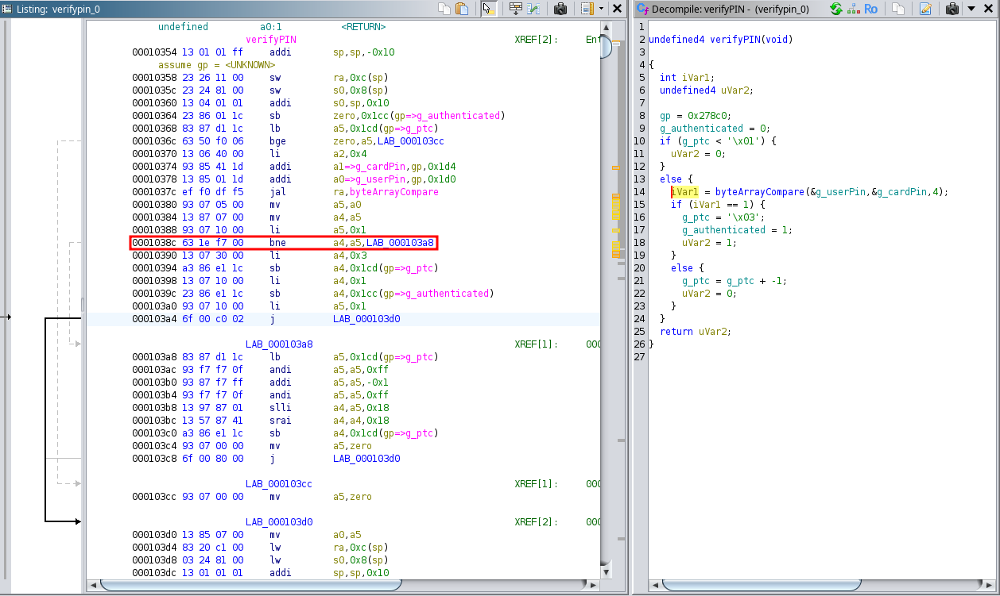
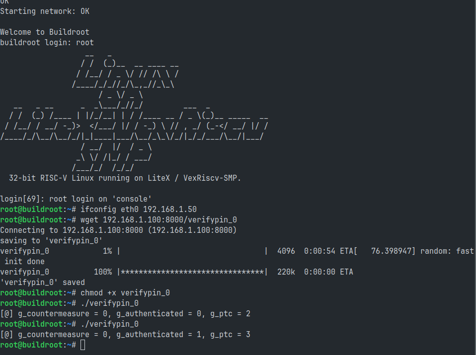

=============================
VexRiscV SMP Linux Verify Pin
=============================

Introduction
------------

For this attack we will target the Wishbone data bus. The emulator will inject faults on the instruction bus connected to the VexRiscV processor. The aim of this attack is to modify the instructions sent by the data bus and modify the control flow of the software executed by the CPU. To present our attack, we have modified the LiteX bus to include a password verification command, the aim being to falsify the password verification to make a normally erroneous password valid.

.. figure:: ../_static/soc_br.svg
   :target: ../_static/soc_br.svg
   :align: center

   SoC used for the PoC.

Build the SoC
-------------

Use the following commands to build the PoC SoC. The software part is given directly in :code:`.bin` format and must be integrated directly into the SoC's :code:`ROM` memory.

.. code-block:: console

    $ cd liteinjector/examples/poc_arty_linux
    $ ./digilent_arty.py --variant=a7-100 --cpu-type=vexriscv_smp --with-ethernet --with-wishbone-memory --csr-csv=csr.csv --csr-json=csr.json --build --load
    $ litex_term /dev/ttyXXX

You should now have access to the Linux login. Use the user :code:`root` to open a shell. We use an HTTP server to upload our PoC programs into the Linux system.

Target analysis
---------------

Before starting fault emulation, we need to analyse the portion of code we want to target. To do this, we use :code:`Ghidra` to find out the instruction to target and retrieve its address using LiteScope.

   Analysis of Verify Pin 0.

The address found thanks to LiteScope is :code:`0xXXXXXXe3`, after analysing the code we need to replace the instruction using a bit reset to reverse the branch instrcution. The will be transformed into :code:`0x00F70E63`.

Let's attack
------------

So we create our emulation campaign using the instruction address as a trigger and change the value of the data bus to the new instruction. 

To launch the attack, first open a new terminal and launch LiteX Server.

.. code-block:: console

    $ litex_server --uart --uart-port /dev/ttyXXX

Now we can use :code:`liteinjector_cli` to launch the attack and reset the 12th bits of the instruction.

.. code-block:: console

    $ liteinjector_cli -v main_basesoc_pbus_adr 0xxxxxxxe3 0 -v main_basesoc_pbus_dat_r 0x00f71e63 0 -br main_basesoc_pbus_dat_r {12} 0

Here is the result of the attack, tested with and without injection.

   
   Result of the attack.