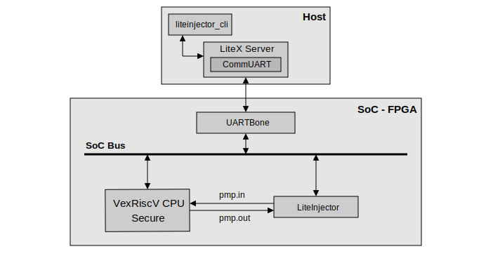
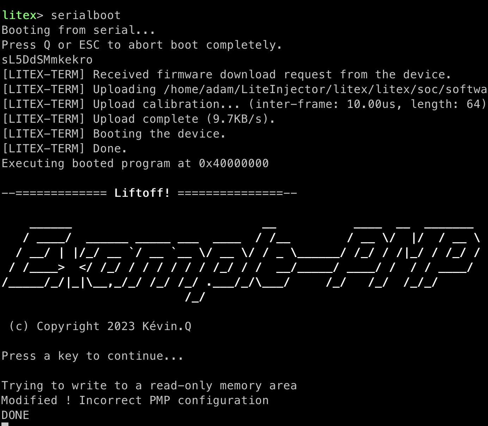

============================
VexRiscV Secure PMP hardware
============================

Introduction
------------

For this attack we will target the PMP inside the CPU. The emulator will inject faults in the PMP guard signal located in the VexRiscV Secure processor. The aim of this attack is to modify the PMP behaviour and stop it from trigger CPU interruption. To present our attack, we have created a program that configures the processor's PMPs, the aim being to access a memory area that is normally protected.

   SoC used for the PoC.

Build the SoC
-------------

Before we can generate the SoC, we need to make a few changes to the LiteX installation. We need to add a new VexRiscV processor variant, a Secure variant instrumented to reach the PMP guard signal inside the processor. All the files are supplied, you just need to put them in the right place.

.. code-block:: console

    $ cd liteinjector/examples/poc_basys3_pmp_hardware
    $ cp hardware/VexRiscv_Secure_PoC.v ../../../pythondata-cpu-vexriscv/pythondata_cpu_vexriscv/verilog/
    $ rm ../../../litex/litex/soc/cores/cpu/vexriscv/core.py
    $ cp hardware/core.py ../../../litex/litex/soc/cores/cpu/vexriscv/

Use the following commands to build the SoC PoC. The software must be generated and then transferred to the SoC's :code:`RAM` memory using the :code:`litex_term` utility.

.. code-block:: console

    $ ./digilent_basys3.py --cpu-variant=secure+poc --csr-csv=csr.csv --integrated-main-ram-size=0x2000 --build --load
    $ cd software
    $ make Vex
    $ litex_term /dev/ttyXXX --kernel=PMPTestWrite_VexRiscv.bin

Once you have run :code:`litex_term`, you must either use the LiteX bios and use the :code:`serialboot` command or :code:`reset` the FPGA board.

Let's attack
------------

The emulation campaign is very simple: we detect when the PMP guard signal is raised to trigger our fault injection. The injection then resets the signal bit, which prevents the processor from being interrupted and gives us access to the protected memory.

To launch the attack, first open a new terminal and launch LiteX Server.

.. code-block:: console

    $ litex_server --uart --uart-port /dev/ttyXXX

Now we can use :code:`liteinjector_cli` to launch the attack.

.. code-block:: console

    $ liteinjector_cli -v main_basesoc_pmp_output 0x1 0 -br main_basesoc_pmp_output [] 0

Here is the result of the attack,.

   
   Result of the attack.