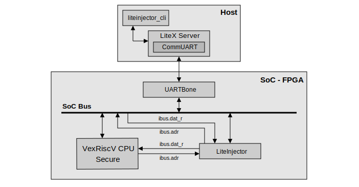
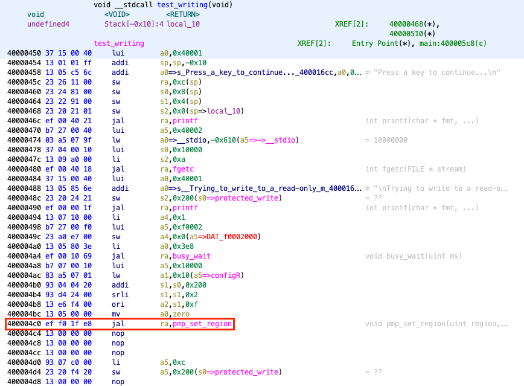

===============================
VexRiscV Secure PMP application
===============================

Introduction
------------

For this attack, we will target the Wishbone data bus. The emulator will inject faults on the instruction bus connected to the VexRiscV variant Secure processor. The aim of this attack is to modify the instructions sent by the data bus and to modify the control flow of the software executed by the CPU. To present our attack, we have created a program that configures the processor's PMPs, the aim being to access a memory area that is normally protected.

   SoC used for the PoC.

Build the SoC
-------------

Use the following commands to build the SoC PoC. The software must be generated and then transferred to the SoC's :code:`RAM` memory using the :code:`litex_term` utility.

.. code-block:: console

    $ cd liteinjector/examples/poc_basys3_pmp_software
    $ ./digilent_basys3.py --cpu-variant=secure --csr-csv=csr.csv --integrated-main-ram-size=0x2000 --build --load
    $ cd software
    $ make Vex
    $ litex_term /dev/ttyXXX --kernel=PMPTestWrite_VexRiscv.bin

Once you have run :code:`litex_term`, you must either use the LiteX bios and use the :code:`serialboot` command or :code:`reset` the FPGA board.

Target analysis
---------------

Before starting fault emulation, we need to analyse the portion of code we want to target. To do this, we use :code:`Ghidra` to find out the instruction to target and retrieve its address using LiteScope.

   Analysis of the software.

The address found thanks to LiteScope is :code:`0x10000130`, after analysing the code we need to replace the instruction with the reverse operation. This instruction has the opcode :code:`0x00000013`, this will :code:`NOP` the code wich call the PMP configuration function.

Let's attack
------------

So we create our emulation campaign using the instruction address as a trigger and change the value of the data bus to the new instruction. 

To launch the attack, first open a new terminal and launch LiteX Server.

.. code-block:: console

    $ litex_server --uart --uart-port /dev/ttyXXX

Now we can use :code:`liteinjector_cli` to launch the attack.

.. code-block:: console

    $ liteinjector_cli -v main_basesoc_ibus_adr 0x10000130 0 -bv main_basesoc_ibus_dat_r 0x00000013 0 -o 2 0

Here is the result of the attack.

.. figure:: ../_static/pmp_sw_result.png
   :target: ../_static/pmp_sw_result.png
   :align: center
   :width: 80%
   
   Result of the attack.