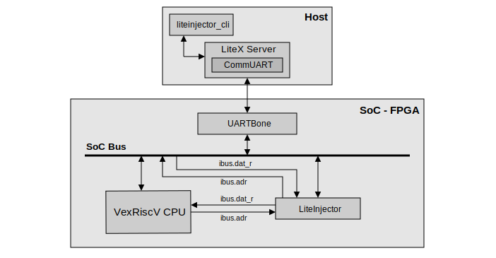
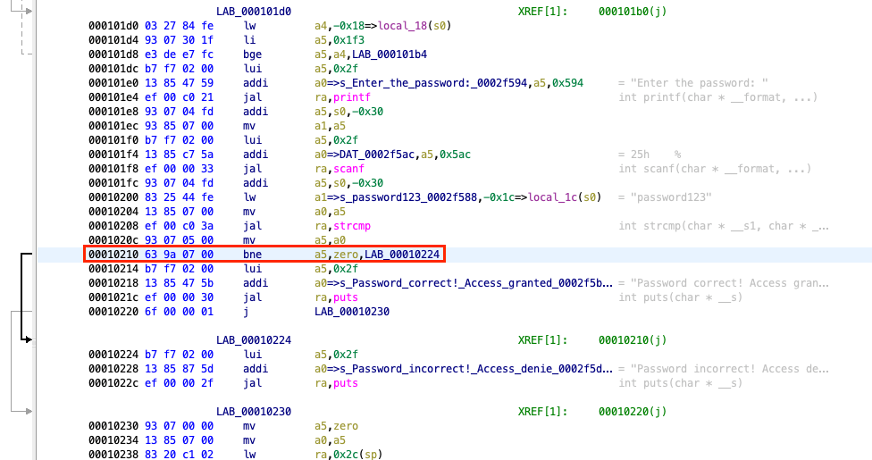
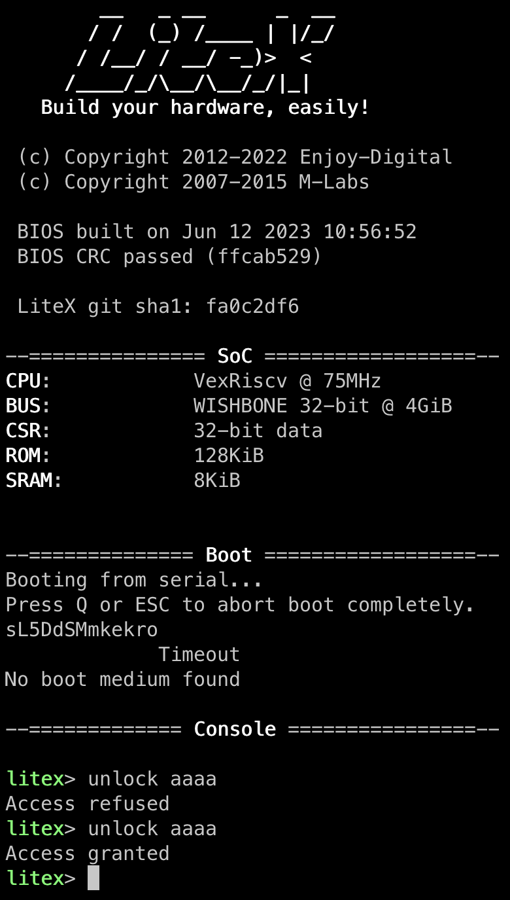

===============================
VexRiscV bare-metal application
===============================

Introduction
------------

For this attack we will target the Wishbone data bus. The emulator will inject faults on the instruction bus connected to the VexRiscV processor. The aim of this attack is to modify the instructions sent by the data bus and modify the control flow of the software executed by the CPU. To present our attack, we have modified the LiteX bus to include a password verification command, the aim being to falsify the password verification to make a normally erroneous password valid.

   SoC used for the PoC.

Build the SoC
-------------

Use the following commands to build the PoC SoC. The software part is given directly in :code:`.bin` format and must be integrated directly into the SoC's :code:`ROM` memory.

.. code-block:: console

    $ cd liteinjector/examples/poc_basys3_vexriscv
    $ ./digilent_basys3.py --csr-csv=csr.csv --integrated-rom-init=software/app.bin --build --load
    $ litex_term /dev/ttyXXX

You're now in the SoC bios, and have access to the :code:`unlock` command. It's this part of the code that we're going to attack. To see the other bios commands use the :code:`help` command.

Target analysis
---------------

Before starting fault emulation, we need to analyse the portion of code we want to target. To do this, we use :code:`Ghidra` to find out the instruction to target and retrieve its address using LiteScope.

   Analysis of the modified bios.

The address found thanks to LiteScope is :code:`0x0000037A`, after analysing the code we need to replace the instruction with the reverse operation. This instruction has the opcode :code:`0x00050C63`.

Let's attack
------------

So we create our emulation campaign using the instruction address as a trigger and change the value of the data bus to the new instruction. 

To launch the attack, first open a new terminal and launch LiteX Server.

.. code-block:: console

    $ litex_server --uart --uart-port /dev/ttyXXX

Now we can use :code:`liteinjector_cli` to launch the attack.

.. code-block:: console

    $ liteinjector_cli -v main_basesoc_ibus_adr 0x0000037A 0 -bv main_basesoc_ibus_dat_r 0x00050C63 0 -o 1 0

Here is the result of the attack, tested with and without injection.

   
   Result of the attack.