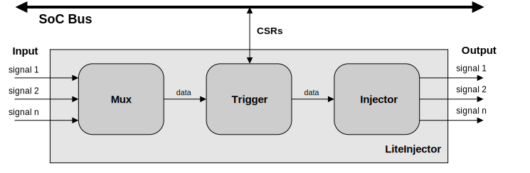
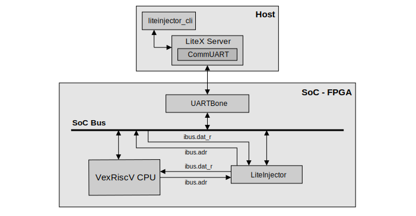

========================
Overview of the emulator
========================

The philosophy behind the tool
------------------------------

As explained in the introduction, our LiteInjector tool is based on the LiteScope project. We take advantage of the LiteX SoC generator to easily create complex SoCs. Our emulator integrates perfectly with these SoCs and can emulate faults in any Migen signal as well as in any signal from an already instrumented component. Using LiteX allows us to develop a software part that can be tested during fault emulation campaigns. The combination of LiteX and LiteInjector provides a complete fault emulation platform for testing both hardware and software. LiteInjector is an easy and powerful way to test your projects with less effort.

Project specifications
----------------------

Before starting the emulator development process, it was essential to define LiteInjector's specifications. This enabled us to determine the features we needed to implement.

Here is the list of specifications for the LiteInjector project : 

* **Easy fault injection in Migen components.**
* **Create a software controller that allows the emulator to be dynamically configured by the attacker.**
* Creating an advanced trigger system :
   - Add a delay to triggering using an offset.
   - Supports logical operations for complex trigger conditions.
   - Making the tigger module reconfigurable.
* The injector should support several FIA models, such as :
   - Bit flip
   - Bit set
   - Bit reset
   - Random bit flip

Emulator architecture
---------------------

The LiteInjector emulator is made up of 3 main components. The first is the "Mux", the purpose of which is to concatenate the input signals connected to the emulator. At the output of the 'Mux', the input signals form a single signal, the size of which is the sum of the size of the input signals. Finally, the mux can be used to form groups of signals and choose which group to use for fault emulation.

The second component is the trigger system. This is very important because it enables events to be detected using the values of the input signals. As with a classic fault injection attack, you need to know when to inject a fault. This is the objective of the trigger system. LiteInjector's trigger system is based on that of the LiteScope project, although it has been improved to meet our needs.

Finally, the last component is the fault injector. This is responsible for modifying the value of one or more targeted signals. The injector receives a signal when an event is detected, and then injects the fault corresponding to the event. To make integration of the emulator as simple as possible for the developer, the input signals are reconstructed at the output of the injector.

   Architecture of the LiteInjector emulator. 

To get a better overview of what a LiteX SoC with the emulator looks like. The package is divided into 2 parts, the first concerns the host machine with the software controller. The software controller uses the LiteX Server utility, which provides the interface between the Whishbone bridge and our software controller. Then there's the SoC built with LiteX. We've used a VexRiscV processor with a standard variant, which is the basic LiteX SoC processor. In this example SoC, we target the instruction bus linking the CPU to the Wishbone data bus. The LiteInjector emulator is then placed between the data bus and the processor. In this example, the fault emulator can modify the control flow of the software running on the processor. You can find everything you need to emulate this attack yourself in the :doc:`proof-of-concept section <../poc/index>`.

   Example SoC where we emulate faults on the instruction bus. 