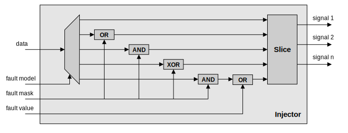

==================================
Architecture of the fault injector
==================================

Basic principle
---------------

There are several methods for injecting faults into a signal, but in our case we've decided to use a masking method. Thanks to logic gates, we can implement all the threat models presented in the project specification. This method is simple to implement and meets our needs, as all fault injection parameters are stored in the trigger system's FIFO. The trigger provides all parameters, including masks and the fault model to be used.

Here's an example of fault injection with a bit reset fault model. To implement this fault model, we use an AND logic gate and our mask will mark the bits to be reset with a 0 and those to be left unchanged with a 1.

   Example of a simple counter value (99).

.. figure:: ../_static/example_mask.svg
   :target: ../_static/example_mask.svg
   :align: center

   Mask used to inject the fault.

   Result of the injection (35).

   Simple demonstration of the injector principle.

Fault injection enabled us to change the counter value from 99 to 35. The method presented here is used for each fault model, modifying the logic gate and mask type to match the specifications of each fault model.

Internal logic details
----------------------

In this section, we will explore the operation of the injector in more detail. The injector is the component responsible for modifying the signals, and is used to emulate faults. The injector is controlled by the trigger system, which configures it by giving it the configuration of the fault to inject.

   Architecture of the injector.

The injector takes several signals as input, and in order to inject faults into the various signals, it takes the concatenated signals as input. This allows the injector to modify the value of several signals at the same time and therefore to perform multi-faulting. There is 1 logic circuit per fault model implemented, as well as a final circuit that allows a fault not to be injected if the trigger signal is not raised. When the fault model is configured, the logic gates required for fault injection use the injector configuration signals. Once fault injection has been carried out, the concatenated signal is sliced to reform the various input signals to make it easier to integrate the emulator into a design.