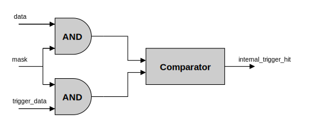
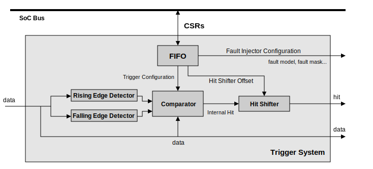

===========================
Trigger system architecture
===========================

What's new ?
------------

We use a masking method similar to that used in the LiteScope project on which we based ourselves. However, LiteInjector's triggering system has been enhanced to detect multiple signal values as well as rising and falling edges simultaneously.

By combining concatenation with the masking system, we can use more complex conditions to detect a greater number of events. Masks are used to select the bit(s) whose value we want to check, and this can also be done on a complete signal. To detect an event, we apply the mask to the input data of the trigger system, then we also apply the mask to the event we wish to detect. Finally, we compare the results of the two masks. If the results are identical, this means that the condition has been met.

   Event detection in the trigger system.

This type of event detector is replicated 3 times in the triggering system, 2 for edge event detection and 1 for signal value. It is the combination of the 3 event detectors that enables complex events to be detected.

In addition to adding support for complex conditions, we have implemented a system for delaying the fault injection release signal. This makes it possible to conduct more elaborate fault injection campaigns and extends the range of possibilities.

In short, we've improved the trigger system in a number of ways. Firstly, by allowing simultaneous detection of signal edges and values, and by adding a fault injection delay system.

Internal logic details
----------------------

In this section, we will explore the operation of the trigger system in more detail, presenting an in-depth analysis of how it works. The trigger system plays a crucial role in the emulator, acting as the brain by dictating the pace of operations. Its main purpose is to detect events from the input signals and tell the injector when to introduce a fault, as well as the parameters associated with that injection, such as the fault model.

   Architecture of the trigger system.

To store all the configuration information for the emulation campaign, the trigger system uses a FIFO queue. This memory is supplied with data by the software controller, so the FIFO is connected to the data bus via memory mapped registers (CSRs). The FIFO contains the trigger system parameters for each event to be detected, as well as the fault injection parameters associated with it.

For the detection part, the edge detection modules have a fairly simple logic. To detect edges, you simply take each bit of the concatenated signal and copy the value of each bit into a register. Then the current value of the bit is compared with the value in the register, and if there is a difference it means that there has been a rising or falling edge. Thanks to this simple logic, we can detect rising and falling edges at each clock tick. We have 2 modules, one for detecting rising edges and one for detecting falling edges. To detect the edges simultaneously, we apply the same masking system explained above. As can be seen from the diagram of the trigger system architecture, we are comparing the data value, the rising edges and the falling edges simultaneously, again using the masking system. The power of this triggering system lies in this simultaneous detection. 

Finally, when an event is detected, an internal trigger signal is raised. This is then relayed by a delay module, which if necessary adds a clock cycle delay to the final trigger signal. Here again, the logic is simple: a simple counter is used, configured using the data in the FIFO. Once the counter has reached the configured value, it raises the fault injection trigger signal.